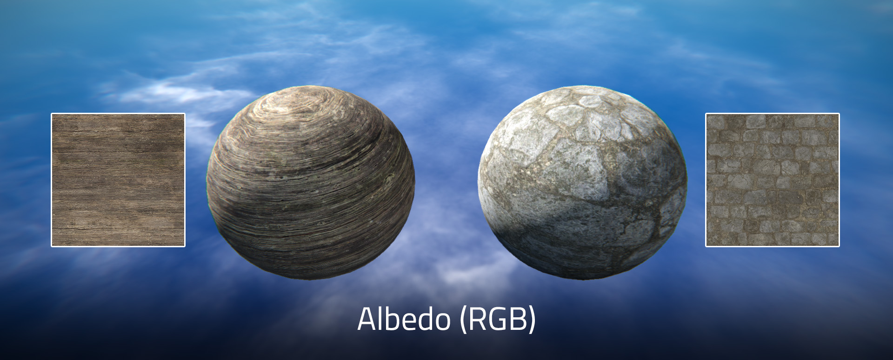
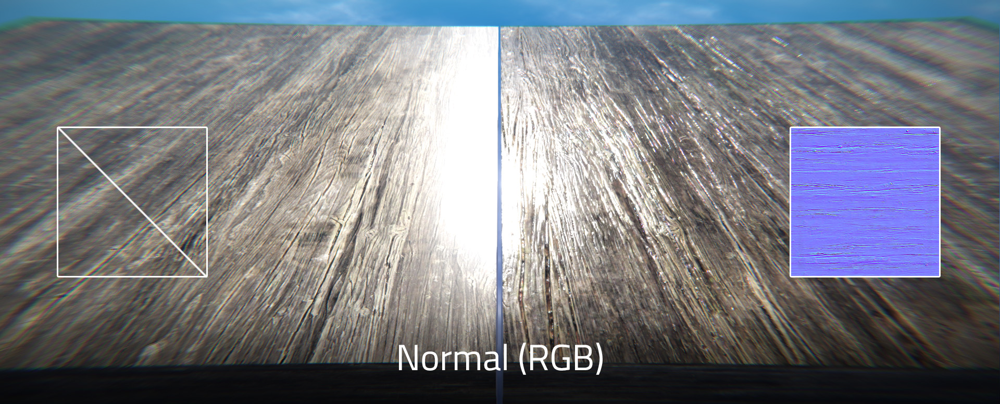
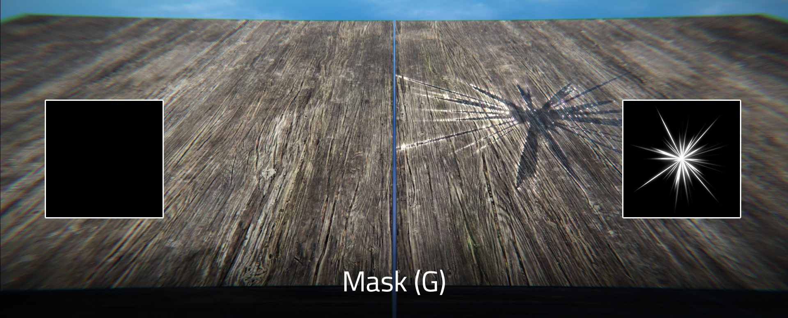

---
outline:
  level: [2, 3]
---

# Assets

First, let's introduce the functions of the row of buttons at the bottom of the Assets panel.

The buttons on the bottom left, from left to right, are:

- `Create Folder`: Creates a new folder under the currently selected category.
- `Clear Cache`: Clears all thumbnail caches.
- `Delete Folder`: Deletes the currently selected folder (the folder must be empty).
- `Mark / Unmark as Favorite`: `Marks` or `Unmarks` the currently selected file as a favorite.
  - Favorited custom folders will be marked yellow.
  - Favorited official folders will be marked green.
- `Hide / Unhide Non-Favorites`: `Hides` or `Unhides` folders that are not marked as favorites.

---

The buttons on the bottom right, from left to right, are:

- `Import / New Asset`: Imports or creates a new asset of the current category.
- `Delete Asset`: Deletes the currently selected asset.
- `Import Folder`: Selects a folder and imports all assets of the current category from it.
- `Show in Explorer`: Opens the folder containing the current asset in the file explorer.

::: tip

There are 2 ways to rename an asset:

- Select the asset and modify it in the `Inspector`.
- Rename the asset file directly in the file explorer.

:::

## Scene

### Append Scene

- Select the scene you want to append.
- Click the `Inspector → Append Scene` button.
- Click `OK`.

Appending a scene imports all items from another scene into the current one, preserving their original position, scale, and rotation.

## Item

### Save Item as Template

- Select the item you want to save.
- Select the `Assets → Items` category and click the first button on the bottom right, `Save Asset`, or directly drag the item into the `Items` panel.
- Enter a name for the template and click the `Save` button.
- After saving successfully, the item will be added to the current folder of the Items category.

::: tip

Multiple items can be saved in a single template:

- Choose one item to be the main item.
- In the `Hierarchy`, drag all the items you want to save onto the main item, making them its children (you can also organize the hierarchy yourself, but there can only be one main item).
- Select the main item and save it following the steps above.
- After saving successfully, the template will preserve the hierarchy, relative positions, rotations, scales, and relative references of all items.

:::

## Mesh

If the built-in items don't meet your mapping needs, you can consider creating your own meshes.

::: tip

Meshes can be dragged directly into the scene for use.

:::

### Import Mesh

- After modeling in 3D software, export the mesh in `.fbx` format.
- Select the `Assets → Meshes` category and click the first button on the bottom right, `Import Mesh`.
- In the dialog box that appears, select the exported `.fbx` file and click the `Open` button.

::: tip

See: [`Start → Preparation → Coordinate System`](../start/preparation#Coordinate-System)

For modeling software that does not support exporting to `.fbx`, you can export the model in another format, import it into Blender, and then export it as an `.fbx`.

Software confirmed to be compatible:

- [Blender](https://blender.org/)

:::

## Texture

### Import Texture

- Prepare your texture map files (`.png`, `.jpg`, `.exr` format).
- Select the `Assets → Textures` category and click the first button on the bottom right, `Import Texture`.
- In the dialog box that appears, select the texture map file and click the `Open` button.

### Texture Properties

After selecting a texture, you can set its properties in the `Inspector`:

- `Filter Mode`: Determines how the texture's color values are interpolated. There are three modes: `Point`, `Bilinear`, and `Trilinear`.
- `Mip Chain`: Adds multiple levels to the texture, allowing it to display different effects at different distances.

After setting, click the `Apply` button to apply the settings.

## Material

BME Pro's material system is a custom PBR material system. Each material consists of three 2048×2048 `.png` texture maps.

### Albedo Map

`RGB` channel: Albedo color. (Required)
`A` channel: Depth or Opacity. (Optional, leave white if not used)

### Normal Map

`RGB` channel: Normal direction. (Optional, do not import if not used)
`A` channel: Currently unused

::: tip

In Adobe Photoshop, you can use the `Filter → 3D → Generate Normal Map...` feature to generate a normal map.

:::

### Mask Map

`R` channel: Emission. (Optional, leave black if not used)

`G` channel: Smoothness. (Optional, leave black if not used)

`B` channel: Metallic. (Optional, leave black if not used)

`A` channel: Ambient Occlusion. (Optional, leave white if not used)

### New Material

- Select the `Assets → Materials` category and click the first button on the bottom right, `New Material`.
- In the dialog box that appears, enter a name for the material and click the `Create` button.

### Material Properties

After selecting a material, you can set its properties in the `Inspector`.

There are 3 material types: `Physically Based`, `Unlit`, `Decal`.

- `Physically Based Material` can be applied to most physical objects.
- `Unlit Material` is generally used for objects that need to be self-illuminating.
- `Decal Material` is used in the [`Decal`](item/decal) component.

::: tip

- Material properties are quite complex, and it is difficult to accurately describe the function of each property in words.
- It is recommended to experiment hands-on, adjusting each property yourself to understand its function and effect.

:::

#### `Albedo`<badge text="All" />

- Type: `Texture`
- Default: Empty

#### `Normal`<badge text="Physically Based" /><badge text="Decal" />

- Type: `Texture`
- Default: Empty

#### `Mask`<badge text="Physically Based" /><badge text="Decal" />

- Type: `Texture`
- Default: Empty

#### `Emission`<badge text="Unlit" />

- Type: `Texture`
- Default: Empty

#### `Albedo Color`<badge text="All" />

- Type: `ColorRGBA`
- Default: `(1, 1, 1, 1)`

#### `Emission Color`<badge text="All" />

- Type: `ColorRGBA`
- Default: `(0, 0, 0, 1)`

::: tip

If the material does not need to emit light, keep the `Emission Color` black `(0, 0, 0, 1)`.

:::

#### `Emission Intensity`<badge text="All" />

- Type: `float`
- Default: `1.0`
- Range: `0.0` ~ `30.0`

#### `Emission Intensity Min`<badge text="Unlit" />

- Type: `float`
- Default: `1.0`
- Range: `0.0` ~ `30.0`

#### `Twinkle Speed`<badge text="Unlit" />

- Type: `float`
- Default: `0.0`

::: tip

The twinkle speed of the official key material is approximately `3.0`.

:::

#### `Metallic`<badge text="Physically Based" /><badge text="Decal" />

- Type: `float`
- Default: `0.0`
- Range: `0.0` ~ `1.0`

#### `Smoothness`<badge text="Physically Based" /><badge text="Decal" />

- Type: `float`
- Default: `0.1`
- Range: `0.0` ~ `1.0`

#### `Ambient Occlusion`<badge text="Physically Based" /><badge text="Decal" />

- Type: `float`
- Default: `0.0`
- Range: `0.0` ~ `5.0`

#### `Normal Scale`<badge text="Physically Based" /><badge text="Decal" />

- Type: `float`
- Default: `1.0`
- Range: `0.0` ~ `5.0`

#### `Overlay Track`<badge text="Physically Based" />

- Type: `bool`
- Default: `true`

::: tip

When `Overlay Track` is checked, the player ball can leave snow trails on this material.

:::

#### `Overlay Noise Scale`<badge text="Physically Based" />

- Type: `float`
- Default: `0.5`
- Range: `0.0` ~ `5.0`

#### `Overlay Noise Blend`<badge text="Physically Based" />

- Type: `float`
- Default: `0.5`
- Range: `0.0` ~ `1.0`

#### `Overlay Clamp`<badge text="Physically Based" />

- Type: `float`
- Default: `0.5`
- Range: `0.0` ~ `1.0`

#### `Overlay Projection`<badge text="Physically Based" />

- Type: `float`
- Default: `0.5`
- Range: `0.0` ~ `1.0`

#### `Overlay Offset`<badge text="Physically Based" />

- Type: `float`
- Default: `0.0`
- Range: `-1.0` ~ `1.0`

#### `Wetness Clamp`<badge text="Physically Based" />

- Type: `float`
- Default: `0.5`
- Range: `0.0` ~ `1.0`

#### `Wetness Offset`<badge text="Physically Based" />

- Type: `float`
- Default: `0.0`
- Range: `-1.0` ~ `1.0`

#### `Smoothness Multiplier`<badge text="Physically Based" />

- Type: `float`
- Default: `1.0`
- Range: `0.0` ~ `5.0`

#### `Tiling`<badge text="All" />

- Type: `Float2`
- Default: `(1, 1)`

::: tip

You can think of `Tiling` as scaling.

:::

#### `Offset`<badge text="All" />

- Type: `Float2`
- Default: `(0, 0)`

#### `Speed`<badge text="All" />

- Type: `Float2`
- Default: `(0, 0)`

::: tip

The material will move on its own according to the `Speed`.

:::

#### `Global UV`<badge text="Physically Based" /><badge text="Unlit" />

- Type: `bool`
- Default: `false`

::: tip

- If `Global UV` is enabled, the material will be rendered based on world coordinates.
- You can choose a `Global UV` material for the <u>stationary roads</u> in the map to ensure their continuity at seams.
- For <u>movable physical objects</u> in the map, do not use a `Global UV` material, otherwise, its texture will change as it moves.

:::

#### `Global UV Tile`<badge text="Global UV = true" type="warning" /><badge text="Physically Based" /><badge text="Unlit" />

- Type: `float`
- Default: `1.0`
- Range: `0.0` ~ `20.0`

#### `Global UV Blend`<badge text="Global UV = true" type="warning" /><badge text="Physically Based" /><badge text="Unlit" />

- Type: `float`
- Default: `1.0`
- Range: `0.0` ~ `20.0`

#### `Top Albedo`<badge text="Global UV = true" type="warning" /><badge text="Physically Based" />

- Type: `Texture`
- Default: Empty

#### `Top Normal`<badge text="Global UV = true" type="warning" /><badge text="Physically Based" />

- Type: `Texture`
- Default: Empty

#### `Top Mask`<badge text="Global UV = true" type="warning" /><badge text="Physically Based" />

- Type: `Texture`
- Default: Empty

#### `Transparency Type`<badge text="Physically Based" /><badge text="Unlit" />

- Type: `Opaque | Alpha Clip | Alpha Blend`
- Default: `Opaque`

#### `Alpha Dither`<badge text="Transparency Type = Alpha Clip" type="warning" /><badge text="Physically Based" /><badge text="Unlit" />

- Type: `bool`
- Default: `false`

#### `Alpha Clip Threshold`<badge text="Transparency Type = Alpha Clip" type="warning" /><badge text="Physically Based" /><badge text="Unlit" />

- Type: `float`
- Default: `0.5`
- Range: `0` ~ `1`

::: tip

- When `Alpha Clip` mode is selected, the material is completely transparent where the albedo map's `A` channel is less than the `Alpha Clip Threshold`, and completely opaque otherwise.
- When `Alpha Blend` mode is selected, the material's opacity depends on the albedo map's `A` channel.

The performance of `Alpha Clip` mode is much higher than `Alpha Blend` mode. If the effect meets expectations, please prioritize using `Alpha Clip` mode.

:::

#### `Affect Albedo`<badge text="Decal" />

- Type: `bool`
- Default: `true`

#### `Affect Normal`<badge text="Decal" />

- Type: `bool`
- Default: `true`

#### `Affect Metallic`<badge text="Decal" />

- Type: `bool`
- Default: `true`

#### `Affect Ambient Occlusion`<badge text="Decal" />

- Type: `bool`
- Default: `true`

#### `Affect Smoothness`<badge text="Decal" />

- Type: `bool`
- Default: `true`

#### `Affect Emission`<badge text="Decal" />

- Type: `bool`
- Default: `true`

#### `Draw Order`<badge text="Decal" />

- Type: `int`
- Default: `0`
- Range: `-50` ~ `50`

## Audio

### Import Audio

- Prepare your audio files in `.ogg` format.
- Select the `Assets → Audios` category and click the first button on the bottom right, `Import Audio`.
- In the dialog box that appears, select the audio file and click the `Open` button.

### Audio Preview

There are two ways to preview audio:

- Double-click the audio file directly to play the music.
- Select the audio file and control its play, pause, stop, and playback position in the `Inspector`.

## Scripts

### Import Script

- Prepare your script files in `.js` format.
- Select the `Assets → Scripts` category and click the first button on the bottom right, `New / Import Script`.
- In the dialog box that appears, click the `Import Script` button.
- In the dialog box that appears, select the script file and click the `Open` button.

### Create Script

- Select the `Assets → Scripts` category and click the first button on the bottom right, `New / Import Script`.
- In the dialog box that appears, click the `Create Script` button.
- In the dialog box that appears, enter a name for the script and click the `Create` button.
- The new script will be created in the current folder.

### Edit Script

- Double-click the script you want to edit / Select the script and click the `Open File` button in the `Inspector`.
- The editor will open automatically, and you can write script code in it.
