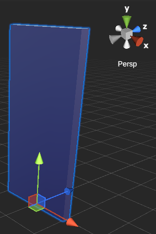

# Joint

The properties of this component are rather obscure and difficult to understand. A few [examples](#Examples) will be provided at the end of this section to help with comprehension.

::: warning

Items used in the Joint component cannot be linked-type items, and all items must have a [`Physics Object`](physicsObject) component.

:::

## `Connect Self`

- Type: `bool`
- Default: `true`

::: warning

When `Connect Self` is set to `true`, please ensure that the item itself has a [`Physics Object`](physicsObject) component.

:::

## `Physics Object A`<badge text="Connect Self = false" />

- Type: `Item`
- Default: Empty

One of the physics objects connected by the joint.

## `Physics Object B`

- Type: `Item`
- Default: Empty

The other physics object connected by the joint.

::: tip

`Physics Object B` can be empty. When empty, the joint only applies constraints to a single physics object.

:::

## `Enable Collision`

- Type: `bool`
- Default: `false`

Whether to keep the collider effect in the physics object enabled. If there are no special circumstances, please keep this value as `false` to ensure smooth movement and rotation.

## `Auto Set Connection`

- Type: `bool`
- Default: `true`

## Joint Point

Used to set the connection point between two physics objects. The visualized position will be displayed in the scene as a multi-colored sphere.

### `Position`

- Type: `Float3`
- Default: `(0, 0, 0)`

### `Axis`

- Type: `Float3`
- Default: `(1, 0, 0)`

### `Perpendicular Axis`

- Type: `Float3`
- Default: `(0, 1, 0)`

## Joint Constraints

Used to set the constraints between two physics objects. Multiple constraints can be added.

### `Constraint Type`

- Type: `Linear | Angular`
- Default: `Linear`

### `Constrained Axis`

- Type: `Bool3`
- Default: `(false, false, false)`

### `Min Max`

- Type: `Float2`
- Default: `(0, 0)`

### `Enable Spring`

- Type: `bool`
- Default: `false`

When the spring is enabled, it allows the physics object's range of motion to exceed the constraint range. A spring force will be applied when the object goes beyond the constraint range; the further it exceeds the range, the greater the spring force. There is no spring effect when it is within the range.

### `Spring Elastic`

- Type: `float`
- Default: `0.0`

### `Spring Damping`

- Type: `float`
- Default: `0.0`

## Examples

### Stone Block

::: tip

This example demonstrates the complete process of using a joint and utilizes the `Road Generator` to generate a mesh, so no external files need to be imported. It is suitable for beginner practice.

For mapping, please use the ready-made item: `Assets → Items → Machinery → StoneBlock`.

:::

1. Create the stone block.
   - `Create → Road Generator`
   - Set `Generator Type` to `Corner`
2. Set the Physics Object properties.
   - Set `Collider Type` to `Box`, do not change the collider-related parameters.
   - Set `Physics Body Type` to `Rigid`.
   - Adjust rigid parameters as needed.
   - Place the object in a suitable position.
3. Add and set up the Joint.
   - Enable the `Joint` component.
   - Set 2 constraints:
     - A linear constraint, locking the `x` and `z` axes, ensuring the object can only move along the `y` axis.
     - An angular constraint, locking the `x`, `y`, and `z` axes, ensuring the object cannot rotate.
     - At this point, the joint behaves as a prismatic joint (similar to a sleeve, piston, etc.).
   - Do not change other parameters.
4. Test in the game. The stone block should now work correctly.

### Push Board

::: tip

This example demonstrates a situation that requires modeling and then importing a mesh.

For mapping, please use the ready-made item: `Assets → Items → Machinery → PushBoard`.

:::

1. Modeling.
   - Use modeling software to create a rectangular prism.
     - Assume here that the push board rotates around the `x`-axis.
     - Reference dimensions: `x = 1m`, `y = 2m`, `z = 0.1m`.
   - Set the pivot point to the center of the bottom face.
   - You can use the rotation tool in your modeling software to rotate around the `x`-axis to test if it meets expectations.
   - UVs and material matching are not considered here.
2. Add and set up the object.
   - [Import](../assets#Import-Mesh) the mesh created in the previous step.
   - The wood material is located at `Assets → Materials → Utility → Wood`.
   - Please complete the other steps yourself.
3. Add and set up the Joint.
   - Add 2 constraints:
     - A linear constraint, locking the `x`, `y`, and `z` axes, ensuring the object cannot move.
     - An angular constraint, locking the `y` and `z` axes, ensuring the object can only rotate around the `x`-axis.
     - At this point, the joint behaves as a revolute joint (similar to a collar, hinge, etc.).
   - Please complete the other steps yourself.
4. Test in the game.
   - The push board should now be able to rotate freely.
   - You need to add limiters and slightly rotate the board to tilt it, ensuring it is in the correct initial position and can work properly.

### Float Board

::: tip

This example adds the use of a linear spring. Please use this example to practice the various operations!

For mapping, please use the ready-made item: `Assets → Items → Machinery → FloatBoard`.

:::

1. Please model and import the mesh and materials yourself, or use existing assets.
   - [Save](itemLink#Save-Mesh) the mesh of `Assets → Items → Machinery → FloatBoard`.
   - Set up 3 materials:
     - `Assets → Materials → Machinery → Machinery_Wood`
     - `Assets → Materials → Machinery → Machinery_Target_Green`
     - `Assets → Materials → Machinery → Machinery_Steel`
2. A linear spring is needed on the `y`-axis.
   - Add a linear constraint, constraining the `y`-axis.
   - Check `Use Linear Spring`.
   - Set the spring parameters as needed.
     - Reference: `Spring Elastic = 0.5`, `Spring Damping = 0.25`.
3. Please complete the other steps yourself.
4. Test in the game.
