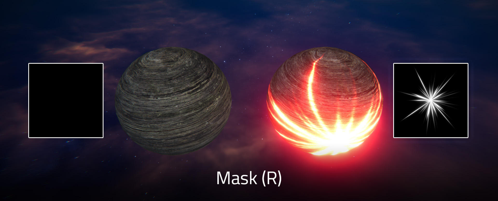
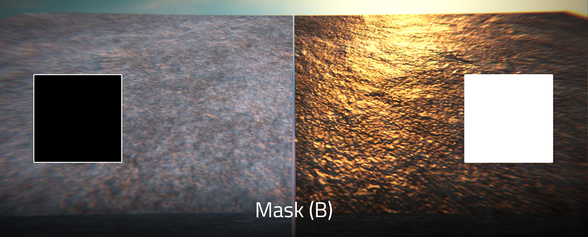
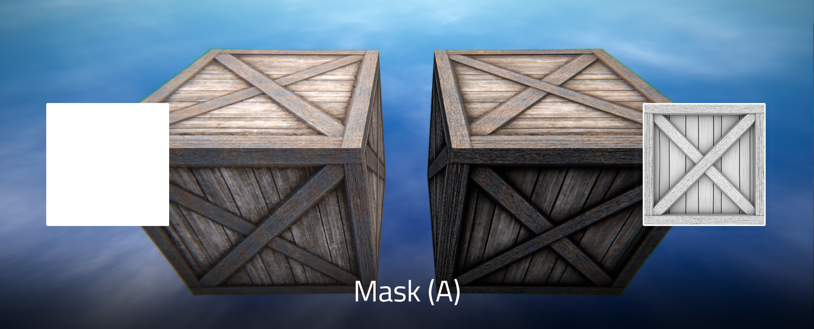

---
outline:
  level: [2, 3]
---

# 素材 #{assets}

首先介绍素材面板底部一排按钮的功能。

底部左侧按钮从左到右分别为：

- `创建文件夹`：在当前选中类别下创建一个新的文件夹
- `清除缓存`：清除所有缩略图缓存
- `删除文件夹`：删除当前选中的文件夹（文件夹必须为空）
- `标记 / 取消标记为收藏`：`标记` 或 `取消标记` 当前选中的文件为收藏
  - 被收藏的自建文件夹将被标黄
  - 被收藏的官方文件夹将被标绿
- `隐藏 / 取消隐藏非收藏`：`隐藏` 或 `取消隐藏` 未被标记为收藏的文件夹

---

底部右侧按钮从左到右分别为：

- `导入 / 新建素材`：导入或新建当前类别的素材
- `删除素材`：删除当前选中的素材
- `导入文件夹`：选择一个文件夹，将其中的属于当前类别的素材全部导入
- `在资源管理器中查看`：在资源管理器中打开当前素材所在的文件夹

::: tip 提示

素材改名有 2 种方式：

- 选中素材后在 `检视器` 中修改
- 直接在资源管理器中对素材文件重命名

:::

## 场景 #{scene}

### 附加场景 #{append-scene}

- 选中需要附加的场景
- 点击 `检视器 → 附加场景` 按钮
- 点击 `确认`

附加场景可以将其他场景中的所有元件导入当前场景，保持原有的位置、缩放、旋转。

## 元件 #{item}

### 保存元件为模板 #{save-item-as-template}

- 选中需要保存的元件
- 选中 `素材 → 元件` 类别，点击底部右侧的第一个按钮 `保存素材`
- 输入模板名称，点击 `保存` 按钮
- 保存成功后，该元件将被添加到元件类别的当前文件夹下

::: tip 提示

一个模板中可保存多个元件：

- 选择其中一个元件作为主元件
- 在 `层级` 中将所有需要保存的元件拖动到主元件上，让它们成为其子元件（你也可以自行组织层级结构，但只能有一个主元件）
- 选中主元件，按照上述步骤保存
- 保存成功后，该模板将保存所有元件的层级结构，相对位置、旋转、缩放，相对引用等信息

:::

## 网格 #{mesh}

如果内置的元件无法满足你的制图需求，你可以考虑自行建模。

::: tip 提示

网格可直接拖至场景中使用。

:::

### 导入网格 #{import-mesh}

- 在三维软件建模后，将网格导出为 `.fbx` 格式
- 选中 `素材 → 网格` 类别，点击底部右侧的第一个按钮 `导入网格`
- 在弹出的对话框中选择导出的 `.fbx` 文件，点击 `打开` 按钮

::: tip 提示

参见：[`起步 → 制图前准备 → 坐标系统`](../start/preparation#坐标系统)

对于不支持导出 `.fbx` 的建模软件，可导出其它格式的模型，导入 Blender 后再导出 `.fbx`。

已经确认可用的软件：

- [Blender](https://blender.org/)

:::

## 纹理 #{texture}

### 导入纹理 #{import-texture}

- 准备好纹理贴图文件（`.png` `.jpg` `.exr` 格式）
- 选中 `素材 → 纹理` 类别，点击底部右侧的第一个按钮 `导入纹理`
- 在弹出的对话框中选择纹理贴图文件，点击 `打开` 按钮

### 纹理属性 #{texture-properties}

选中纹理后，可在 `检视器` 中设置其纹理属性：

- `过滤模式`：决定纹理的颜色值如何插值，有 `临近点` `双线性` `三线性` 三种模式
- `多级渐进纹理`：在纹理中加入多个级别，使得纹理在不同距离下显示不同效果

设置完毕后，点击 `应用` 按钮以应用设置。

## 材质 #{material}

BME Pro 的材质系统为特制的 PBR 材质系统，每个材质包含三张 2048×2048 `.png` 纹理贴图。

### 漫射贴图 #{albedo-map}

`RGB` 通道：漫射颜色。（必需）
`A` 通道：深度或不透明度。（可选，不使用留白色）

### 法线贴图 #{normal-map}

`RGB` 通道：法线方向。（可选，不使用则不导入）
`A` 通道：暂无用途

::: tip 提示

在 Adobe Photoshop 中，可以使用 `滤镜 → 3D → 生成法线图……` 功能生成法线贴图。

:::

### 遮罩贴图 #{mask-map}

`R` 通道：自发光。（可选，不使用留黑色）

`G` 通道：光滑度。（可选，不使用留黑色）

`B` 通道：金属度。（可选，不使用留黑色）

`A` 通道：环境光遮蔽。（可选，不使用留白色）

### 新建材质 #{new-material}

- 选中 `素材 → 材质` 类别，点击底部右侧的第一个按钮 `新建材质`
- 在弹出的对话框中输入材质名称，点击 `创建` 按钮

### 材质属性 #{material-properties}

选中材质后，可在 `检视器` 中设置其材质属性。

材质类型分为 3 类：`物理` `无光照` `贴花`

- `物理材质` 可应用于大部分物理物体上
- `无光照材质` 一般应用于需要自发光的物体上
- `贴花材质` 应用于 [`贴花投射器`](item/decal) 组件中

::: tip 提示

- 材质属性较为复杂，难以用文字准确描述每个属性的作用
- 建议实际上手操作，自己调节每个属性，领悟每个属性的作用和效果

:::

#### `漫射`<badge text="全部" /> #{albedo}

- 类型：`Texture`
- 默认值：空

#### `法线`<badge text="物理" /><badge text="贴花" /> #{normal}

- 类型：`Texture`
- 默认值：空

#### `遮罩`<badge text="物理" /><badge text="贴花" /> #{mask}

- 类型：`Texture`
- 默认值：空

#### `发光`<badge text="无光照" /> #{emission}

- 类型：`Texture`
- 默认值：空

#### `漫射颜色`<badge text="全部" /> #{albedo-color}

- 类型：`ColorRGBA`
- 默认值：`(1, 1, 1, 1)`

#### `发光颜色`<badge text="全部" /> #{emission-color}

- 类型：`ColorRGBA`
- 默认值：`(0, 0, 0, 1)`

::: tip 提示

若不需要材质发光，保持 `发光颜色` 颜色为黑色 `(0, 0, 0, 1)`。

:::

#### `发光强度`<badge text="全部" /> #{emission-intensity}

- 类型：`float`
- 默认值：`1.0`
- 范围：`0.0` ~ `30.0`

#### `最低发光强度`<badge text="无光照" /> #{emission-intensity-min}

- 类型：`float`
- 默认值：`1.0`
- 范围：`0.0` ~ `30.0`

#### `闪烁速度`<badge text="无光照" /> #{twinkle-speed}

- 类型：`float`
- 默认值：`0.0`

::: tip 提示

官方钥匙材质闪烁速度大致为 `3.0` 。

:::

#### `金属度`<badge text="物理" /><badge text="贴花" /> #{metallic}

- 类型：`float`
- 默认值：`0.0`
- 范围：`0.0` ~ `1.0`

#### `光滑度`<badge text="物理" /><badge text="贴花" /> #{smoothness}

- 类型：`float`
- 默认值：`0.1`
- 范围：`0.0` ~ `1.0`

#### `环境光遮罩`<badge text="物理" /><badge text="贴花" /> #{ambient-occlusion}

- 类型：`float`
- 默认值：`0.0`
- 范围：`0.0` ~ `5.0`

#### `法线强度`<badge text="物理" /><badge text="贴花" /> #{normal-scale}

- 类型：`float`
- 默认值：`1.0`
- 范围：`0.0` ~ `5.0`

#### `启用轨迹`<badge text="物理" /> #{overlay-track}

- 类型：`bool`
- 默认值：`true`

::: tip 提示

勾选 `启用轨迹` 后，玩家球可以在该材质上留下雪痕。

:::

#### `噪波缩放`<badge text="物理" /> #{overlay-noise-scale}

- 类型：`float`
- 默认值：`0.5`
- 范围：`0.0` ~ `5.0`

#### `噪波混合`<badge text="物理" /> #{overlay-noise-blend}

- 类型：`float`
- 默认值：`0.5`
- 范围：`0.0` ~ `1.0`

#### `叠加范围限制`<badge text="物理" /> #{overlay-clamp}

- 类型：`float`
- 默认值：`0.5`
- 范围：`0.0` ~ `1.0`

#### `顶部投射`<badge text="物理" /> #{overlay-projection}

- 类型：`float`
- 默认值：`0.5`
- 范围：`0.0` ~ `1.0`

#### `叠加强度偏移`<badge text="物理" /> #{overlay-offset}

- 类型：`float`
- 默认值：`0.0`
- 范围：`-1.0` ~ `1.0`

#### `湿度范围限制`<badge text="物理" /> #{wetness-clamp}

- 类型：`float`
- 默认值：`0.5`
- 范围：`0.0` ~ `1.0`

#### `湿度强度偏移`<badge text="物理" /> #{wetness-offset}

- 类型：`float`
- 默认值：`0.0`
- 范围：`-1.0` ~ `1.0`

#### `湿度光滑度乘数`<badge text="物理" /> #{smoothness-multiplier}

- 类型：`float`
- 默认值：`1.0`
- 范围：`0.0` ~ `5.0`

#### `平铺`<badge text="全部" /> #{tiling}

- 类型：`Float2`
- 默认值：`(1, 1)`

::: tip 提示

可将 `平铺` 理解为缩放。

:::

#### `偏移`<badge text="全部" /> #{offset}

- 类型：`Float2`
- 默认值：`(0, 0)`

#### `速度`<badge text="全部" /> #{speed}

- 类型：`Float2`
- 默认值：`(0, 0)`

::: tip 提示

材质将根据 `速度` 自行移动。

:::

#### `启用全局坐标`<badge text="物理" /><badge text="无光照" /> #{global-uv}

- 类型：`bool`
- 默认值：`false`

::: tip 提示

- 若启用 `启用全局坐标`，则材质将根据全局坐标进行渲染
- 可以为图中<u>静止不动的路面</u>选择 `全局坐标` 材质，可以保证其在接缝处的连贯性
- 对于图中<u>可运动的物理物体</u>，请不要使用 `全局坐标` 材质，否则其材质会随着运动而变化

:::

#### `全局坐标平铺`<badge text="启用全局坐标 = true" type="warning" /><badge text="物理" /><badge text="无光照" /> #{global-uv-tile}

- 类型：`float`
- 默认值：`1.0`
- 范围：`0.0` ~ `20.0`

#### `全局坐标混合`<badge text="启用全局坐标 = true" type="warning" /><badge text="物理" /><badge text="无光照" /> #{global-uv-blend}

- 类型：`float`
- 默认值：`1.0`
- 范围：`0.0` ~ `20.0`

#### `顶部漫射`<badge text="启用全局坐标 = true" type="warning" /><badge text="物理" /> #{top-albedo}

- 类型：`Texture`
- 默认值：空

#### `顶部法线`<badge text="启用全局坐标 = true" type="warning" /><badge text="物理" /> #{top-normal}

- 类型：`Texture`
- 默认值：空

#### `顶部遮罩`<badge text="启用全局坐标 = true" type="warning" /><badge text="物理" /> #{top-mask}

- 类型：`Texture`
- 默认值：空

#### `透明类型`<badge text="物理" /><badge text="无光照" /> #{transparency-type}

- 类型：`不透明 | 透明度裁切 | 透明度混合`
- 默认值：`不透明`

#### `透明度抖动`<badge text="透明类型 = 透明度裁切" type="warning" /><badge text="物理" /><badge text="无光照" /> #{alpha-dither}

- 类型：`bool`
- 默认值：`false`

#### `透明度裁切阈值`<badge text="透明类型 = 透明度裁切" type="warning" /><badge text="物理" /><badge text="无光照" /> #{alpha-clip-threshold}

- 类型：`float`
- 默认值：`0.5`
- 范围：`0` ~ `1`

::: tip 提示

- 选择 `透明度裁切` 模式时，材质在漫射贴图 `A` 通道小于 `透明度裁切阈值` 的位置完全透明，反之完全不透明
- 选择 `透明度混合` 模式时，材质不透明度取决于漫射贴图 `A` 通道

`透明度裁切` 模式的性能远高于`透明度混合` 模式，在效果满足期望的情况下，请优先选择`透明度裁切` 模式

:::

#### `影响漫射`<badge text="贴花" /> #{affect-albedo}

- 类型：`bool`
- 默认值：`true`

#### `影响法线`<badge text="贴花" /> #{affect-normal}

- 类型：`bool`
- 默认值：`true`

#### `影响金属度`<badge text="贴花" /> #{affect-metallic}

- 类型：`bool`
- 默认值：`true`

#### `影响环境光遮蔽`<badge text="贴花" /> #{affect-ambient-occlusion}

- 类型：`bool`
- 默认值：`true`

#### `影响光滑度`<badge text="贴花" /> #{affect-smoothness}

- 类型：`bool`
- 默认值：`true`

#### `影响发光`<badge text="贴花" /> #{affect-emission}

- 类型：`bool`
- 默认值：`true`

#### `绘制顺序`<badge text="贴花" /> #{draw-order}

- 类型：`int`
- 默认值：`0`
- 范围：`-50` ~ `50`

## 音频 #{audio}

### 导入音频 #{import-audio}

- 准备好 `.ogg` 格式的音频文件
- 选中 `素材 → 音频` 类别，点击底部右侧的第一个按钮 `导入音频`
- 在弹出的对话框中选择音频文件，点击 `打开` 按钮

### 音频预览 #{audio-preview}

音频预览有两种方式：

- 直接双击音频文件播放音乐
- 选中音频文件后，在 `检视器` 中控制其播放、暂停、停止以及播放位置

## 脚本 #{scripts}

### 导入脚本 #{import-script}

- 准备好 `.js` 格式的脚本文件
- 选中 `素材 → 脚本` 类别，点击底部右侧的第一个按钮 `新建 / 导入脚本`
- 在弹出的对话框中点击 `导入脚本` 按钮
- 在弹出的对话框中选择脚本文件，点击 `打开` 按钮

### 创建脚本 #{create-script}

- 选中 `素材 → 脚本` 类别，点击底部右侧的第一个按钮 `新建 / 导入脚本`
- 在弹出的对话框中点击 `创建脚本` 按钮
- 在弹出的对话框中输入脚本名称，点击 `创建` 按钮
- 新建脚本会被创建在当前文件夹内

### 编辑脚本 #{edit-script}

- 双击需要编辑的脚本 / 选中脚本后在 `检视器` 中点击 `打开文件` 按钮
- 编辑器会自动打开，可在编辑器中编写脚本代码
